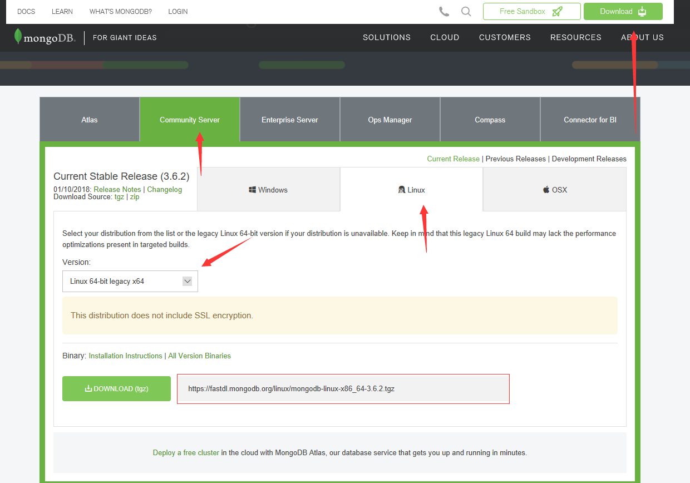

# 安装MongoDB

## 下载
现在我们去[MongoDB官网](https://www.mongodb.com/download-center?jmp=nav#community)下载社区版



使用命令下载
```
wget https://fastdl.mongodb.org/linux/mongodb-linux-x86_64-3.6.2.tgz
```
下载完成后解压缩到目录 `/usr/local/`, 重命名为 `mongodb`
```
tar -zxvf mongodb-linux-x86_64-3.6.2.gz -C /usr/local/

mv /usr/local/mongodb-linux-x86_64-3.6.2 /usr/local/mongodb
```

## 配置
创建数据库地址与日志地址
```
mkdir -p /usr/local/mongodb/data

mkdir -p /usr/local/mongodb/log
```
配置环境变量
```
vim /root/.bashrc

export PATH=/usr/local/mongodb/bin:$PATH

source /root/.bashrc
```
启动数据库
```
mongod --dbpath /usr/local/mongodb/data --logpath /usr/local/mongodb/log/mongo.log --fork --auth --bind_ip 0.0.0.0
```
进入 `MongoDB` 命令行
```
mongo
```
创建管理员用户
```
use admin;

db.createUser({user: "root", pwd: "password",roles: [{ role: "userAdminAnyDatabase", db: "admin" }]})
```
在 `admin` 集合中登录
```
use admin;

db.auth("root","password");
```
为某个库创建用户
```
db.createUser({user: "用户名", pwd: "密码",roles: [{ role: "readWrite", db: "集合名称" }]})
```
远程连接到某个集合
```
mongo ip:port/集合名称
```
防火墙开启27017端口
```
firewall-cmd --zone=public --add-port=27017/tcp --permanent
```
