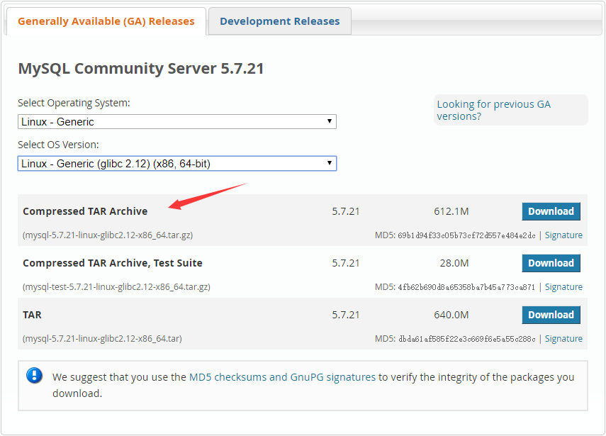
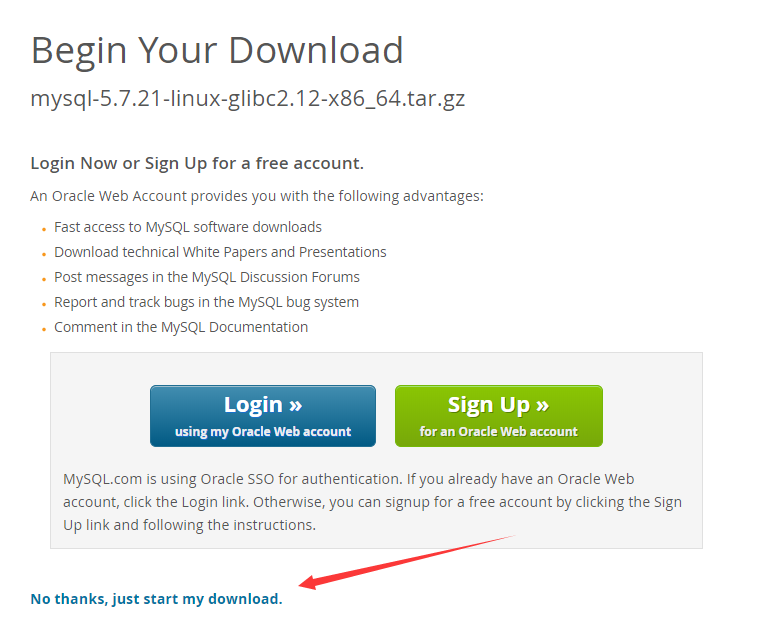

# 安装MySQL

## 准备
在 `CentOS 7` 上安装　`MySQL5.7` ，系统中一般会预装 `mariadb`，查看系统中是否预装
```
rpm -qa | grep mariadb
```
这时候你会看到如下提示
> mariadb-libs-5.5.56-2.el7.x86_64

此软件是代替 `MySQL` ，语法完全兼容，不过现在相比较还是 `MySQL` 比较大众，用如下命令将其删除
```
rpm -e --nodeps mariadb-libs-5.5.56-2.el7.x86_64
```

## 下载
现在我们去[MySQL官网](https://dev.mysql.com/downloads/mysql/)下载社区版



获取下载连接



使用命令下载
```
wget https://dev.mysql.com/get/Downloads/MySQL-5.7/mysql-5.7.21-linux-glibc2.12-x86_64.tar.gz
```
下载完成后解压缩到目录 `/usr/local/`, 重命名为 `mysql`
```
tar -zxvf mysql-5.7.21-linux-glibc2.12-x86_64.tar.gz -C /usr/local/

mv mysql-5.7.21-linux-glibc2.12-x86_64 mysql
```
## 安装
在系统中给 `MySQL` 创建组与用户
```
groupadd mysql

useradd -s /sbin/nologin -M -g mysql mysql
```
创建数据库存放目录
```
mkdir -p /usr/local/mysql/data
```
添加权限
```
chown -R mysql:mysql /usr/local/mysql
```
生成数据库
```
/usr/local/mysql/bin/mysqld --initialize-insecure --user=mysql --basedir=/usr/local/mysql --datadir=/usr/local/mysql/data
```

如果有如下报错
> /usr/local/mysql/bin/mysqld: error while loading shared libraries: libnuma.so.1: cannot open shared object file: No such file or directory  

需要安装依赖
```
yum install -y numactl
```
启动 | 重启 | 停止 `MySQL`
```
/usr/local/mysql/support-files/mysql.server start | restart | stop
```
配置环境变量
```
vim /root/.bashrc

export PATH=/usr/local/mysql/bin:$PATH

source /root/.bashrc
```
更改 `MySQL` 密码
```
mysqladmin -u root -p password
```
本地登录MySQL
```
mysql -h localhost -uroot -p
```
创建远程连接账户
```
USE mysql;

GRANT ALL PRIVILEGES ON *.* TO 'root'@'%' IDENTIFIED BY 'password' WITH GRANT OPTION;

FLUSH PRIVILEGES;
```
防火墙开启 `3306` 端口
```
firewall-cmd --zone=public --add-port=3306/tcp --permanent
```